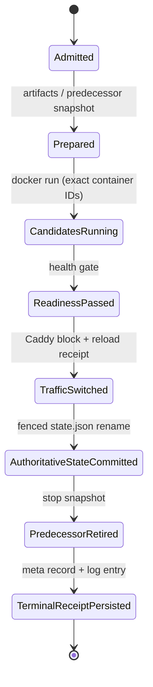

# C01 — Crash-recovery state table (ADR)

Programme workstream C01 (P0), landing the implementation handoff's
"Crash-recovery design obligations" as **tested code**: the deploy
lifecycle state table, the crash-window disposition lattice, and the
fault-prototype harness. The decision function is
`internal/deploy/recovery.Decide(from, observation)`; its exhaustive test
enumerates every state × every evidence combination (8 × 3^10). A table in
a doc alone was explicitly insufficient — this doc records the design; the
package is the contract.

## The lattice



This is `DeployFenced`'s commit order (`internal/deploy/deploy.go:235-939`),
generalized. Ingress variants: `ingress: host` publishes the fixed port on
the candidate itself (the TrafficSwitched receipt is the port binding, not
a Caddy block); `ingress: external` has no edge step at all (the transition
is a no-op and the receipt is vacuous).

## Per-transition evidence and crash-window dispositions

Each transition carries the durable evidence that proves it landed (names
aligned with what the code persists today) and the disposition for an owner
that dies inside the transition's window. Also encoded as data in
`recovery.Lattice()`.

| # | Transition | Durable evidence (file:line) | Crash in window | Why |
|---|---|---|---|---|
| 1 | admitted → prepared | attempt dir `/deployments/<app>/meta/att/<hash>.<id>/` (`internal/releasemeta/attempt.go:107-116`); owner token in `.lock/info` (`internal/state/lock.go:86-92`, `internal/state/state.go:522-533`) | **RETRY** | attempt paths are random-id write-once; a fresh attempt collides with nothing |
| 2 | prepared → candidates-running | container IDs from docker run (`internal/deploy/deploy.go:577-607`); names `{app}-{process}-{version}[-{index}]` + `teploy.*` labels (`internal/docker/docker.go:82-117,160-165`) | **INSPECT** | a running candidate with no receipt is never success; corpses are reconciled by the next attempt (`deploy.go:1282-1292`) |
| 3 | candidates-running → readiness-passed | readiness receipt `meta/att/<hash>.<id>/readiness.json` — exact candidate IDs + probes + outcome, written on pass before the switch (`internal/deploy/journal.go`, **LANDED 2026-09-22, C01-4**) | **INSPECT** | without the receipt the window is unobservable post-crash; the owner must re-probe. With it, `attemptReadinessState`/`candidateAttribution` derive `ReadinessPassed` + attributable candidates for `Decide` |
| 4 | readiness-passed → traffic-switched | managed marker block `# TEPLOY BEGIN <app>`…`END` naming candidate upstreams (`internal/caddy/caddy.go:20-21,584-625`); reload receipt (`caddy.go:29-32`); delivery verification md5 host-vs-container (`caddy.go:523-550`) | **COMPENSATE** | traffic on an uncommitted generation; undo via the recorded/serving predecessor (`abortStateCommit`, `deploy.go:1036-1095`). MANUAL when the predecessor is gone |
| 5 | traffic-switched → authoritative-state-committed | fenced rename of `state.json` naming the release (`internal/state/lock.go:353-381`); `Generation`/`OperationID` (`internal/state/state.go:68-95`) | **COMPENSATE** | the commit is the single fenced atomic effect; before it, traffic is uncommitted |
| 6 | authoritative-state-committed → predecessor-retired | predecessor snapshot stopped (`internal/deploy/deploy.go:839-861,963-989`); absence in the label inventory (`internal/docker/docker.go:568-571`) | **RETRY** | retirement re-derives from the inventory; failures reported, never silent |
| 7 | predecessor-retired → terminal-receipt-persisted | record `/deployments/<app>/meta/<hash>.json` 0600 atomic (`internal/releasemeta/releasemeta.go:216-248`); log entry `/deployments/teploy.log` (`internal/state/state.go:662-679`) | **RETRY** | convergent: same-version record rewrite and live-container backfill (`releasemeta.go:336-473`) both heal a missing record |

Which transitions can be **retried**: 1, 6, 7 (idempotent or convergent).
**Inspected**: 2, 3 (effects landed without receipts). **Compensated**: 4,
5 (undo via predecessor). **Explicit recovery decision (MANUAL)**: any
observation class the automation must not attribute — unattributable
containers, unreadable authority, traffic on an uncommitted generation
with the predecessor gone.

## Disposition rules

`Decide` is a pure, total function over (from-state, observed evidence).
Evidence classes are tri-state (`absent`/`present`/`unknown`) and are
PROVEN states of the target — exact container names and receipts, never
guesses. Rules in evaluation order (`recovery.go`):

- **R0** self-contradictory bookkeeping → MANUAL
- **R1** unattributable workloads (running `teploy.app`-labeled containers
  under names that are neither candidate nor predecessor) → MANUAL
- **R2** authority (state.json) unreadable → MANUAL
- **R3** traffic PROVEN on a generation the authority does not name, with
  the predecessor PROVEN gone → MANUAL, regardless of what the records
  claim
- **R4** any other unreadable class → INSPECT (re-observe; never
  RETRY/COMPENSATE on unreadable evidence)
- **R5** edge names both generations → INSPECT (reconcile against records)
- **R6** record/target disagreement on whether the commit happened →
  INSPECT (the crash was elsewhere than recorded, or an operator moved
  authority via rollback — never blindly redeploy)
- **R7** authority dispatch — committed: finish the idempotent tail
  (RETRY) unless the edge contradicts (INSPECT); uncommitted: traffic on
  candidates → COMPENSATE, running candidate without receipt → INSPECT,
  displaced predecessor with no candidate → COMPENSATE (the app is dark),
  nothing landed → RETRY; no state at all: running candidate → INSPECT,
  else RETRY

The exhaustive test (`recovery_test.go`, `TestExhaustiveProductSpace`)
asserts the cross-cutting invariants over the full 8 × 59049 product space:
unattributable/unreadable-authority never auto-decided; COMPENSATE only
with a restorable predecessor under predecessor authority; RETRY only on
fully readable, non-conflicting, attributable evidence; never invented
success (an uncommitted running candidate without edge commitment is
INSPECT at minimum).

## Mapping onto the existing machinery — what already agrees

- **Fenced locks (F16, `internal/state/lock.go`)** provide Admitted and
  the fenced state commit: `AcquireLockFenced` mints the owner token,
  renewal keeps a slow owner from being falsely broken, `WriteFenced` is
  the one guard+effect-composed atomic, and `ReleaseLockFenced` (A04/T02)
  never deletes a successor's lock. Transition 5's disposition rests on
  exactly this.
- **Unfenced compensation (deliberate, register A07)** matches the table:
  `restoreDisplacedAndStarted` and `abortStateCommit` run on detached
  bounded contexts (A11) after fence loss — refusing to clean up one's own
  partial effects is how a fencing design strands an app.
- **`abortStateCommit` (`deploy.go:1036-1095`)** is the table's
  transition-4/5 COMPENSATE, including the recreate-strategy branch
  (restart displaced fixed-port workload) and A10's route-restore ordering.
- **Attempt artifacts (F08, `internal/releasemeta/attempt.go`)** make
  transition 1 retryable: write-once, random-id, never rewritten.
- **Record convergence (F14, `internal/releasemeta/releasemeta.go`)** makes
  transition 7 retryable: same-version rewrite is the documented
  immutability exception and `Backfill` (`releasemeta.go:336-473`)
  converges pre-F14 installs.
- **Caddy edit transaction (F45/F48/F49, `internal/caddy/caddy.go:437-511`)**:
  adapt gate pre-write, rollback+reload-restore on failure, delivery
  verification — the receipts transition 4 cites.

## Disagreements between current code and the table (findings)

These are the deltas the C01 implementation slices must close. Each is a
statement of where today's code's effective disposition differs from the
table's, with the register item it belongs to.

1. **C01-1 — Lock acquisition is treated as quiescence.**
   `acquireAutoLock` (`internal/state/state.go:479-516`) breaks a stale
   lock and proceeds directly into a deploy; nothing reconciles in-flight
   effects from the dead holder. A late `docker run` issued by the dead
   owner lands under version-keyed names; a same-version collision
   surfaces later as a generic docker error, not a reconciliation. The
   table requires: a replacement owner runs `Decide` over observed
   evidence after acquisition. Register: A05/T01 adjacent but distinct —
   fencing refuses stale *check-then-act* holders; this is the new owner's
   side (nobody observes the leftover world). **LANDED 2026-09-23** (see
   AUDIT_OPEN's C01 replacement-owner-reconciliation slice): acquisitions
   report takeover (`Lock.TookOver`), `DeployFenced` runs the
   productionized observer + `Decide` (`internal/deploy/reconcile.go`)
   before its first effect, RETRY is the only proceed disposition, and
   every other one refuses with the observed evidence. The observer is
   the harness's evidence collector made production code; verified
   against the real fixture (late effect after takeover → MANUAL
   refusal).

2. **C01-2 — Pre-commit effects are check-then-act, not guarded.**
   `lk.Check` runs as a separate command from the effect it guards:
   candidate starts (`internal/deploy/deploy.go:570-577`), worker starts
   (`deploy.go:661-663`), route switch (`deploy.go:712-731`). Only the
   state commit composes guard+effect in one shell (`WriteFenced`,
   `internal/state/lock.go:377`). Between check and effect a takeover can
   occur, so a broken holder's candidate/route effects can land inside the
   new owner's window — the table treats "effect lands after owner death"
   as INSPECT-at-best evidence, which nothing today generates. Register:
   A05/T01 standing; the table now states the disposition consequence.
   **LANDED 2026-09-23** (see AUDIT_OPEN's C01 guarded-effects slice):
   `docker.RunGuarded` composes the holdership guard with the container
   creation in one remote command (deploy's candidate and worker starts;
   `state.Lock.GuardPrefix`/`state.FenceLost` are the composition
   surface), and the Caddyfile commit rename runs under the same guard
   (`caddy.Client.WithCommitGuard`, threaded through deploy, rollback and
   the static paths). A mid-flight takeover is refused in-shell: no
   container starts, no route edit lands, no reload runs. The separate
   pre-effect Checks at those three sites are superseded by the
   composition.

3. **C01-3 — The shared Caddy lock is ownerless and unfenced.**
   `internal/caddy/caddy.go:684-697` breaks any caddy lock older than 120s
   and carries no owner identity; a slow or queued edit from an orphaned
   owner can interleave with the new owner's `mutate`. The table's
   "conflicting route evidence → INSPECT" has no producer/consumer today
   (nobody reconciles a Caddyfile that names containers no inventory can
   attribute). Register: T03 documents the design as deliberate; the
   finding is the missing reconciliation, not the lock's shape. **LANDED
   2026-09-23** (see AUDIT_OPEN's C01 shared-proxy-lock slice): the lock
   carries an owner-tagged info file (staleness from its timestamp, not
   directory mtime; legacy no-info dirs keep the mtime fallback), the
   commit is fenced by the lock's own guard composed AFTER the app-fence
   guard, release is conditional on ownership (the app locks' A04
   lesson), and the missing producer/consumer exists:
   `deploy.Observe` classifies a managed block naming a third generation
   as CONFLICTING (Unknown) route evidence, which `Decide` sends to
   INSPECT (R4) instead of the old false "route to predecessor".

4. **C01-4 — No durable readiness receipt.** The health gate
   (`internal/deploy/health.go`, `deploy.go:646-658`) persists nothing, so
   ReadinessPassed is unobservable post-crash and its recovery disposition
   collapses into CandidatesRunning's INSPECT. A receipt (attempt-scoped
   marker recording the probed port/time/result) is a design obligation
   for the helper/journal slice. **LANDED 2026-09-22** (see AUDIT_OPEN's
   C01 implementation slice): `meta/att/<hash>.<id>/readiness.json`,
   written exactly on pass before the switch, with the
   `attemptReadinessState`/`candidateAttribution` evidence derivation
   asserted through `recovery.Decide` (COMPENSATE with, INSPECT without).

5. **C01-5 — The terminal receipt records success on incomplete
   retirement.** Predecessor stop/remove failures are warnings
   (`internal/deploy/deploy.go:976-989`) but `logDeploy(ctx, cfg, true, …)`
   (`deploy.go:934`) still appends `Success: true`, and
   `state.LogEntry` (`internal/state/state.go:98-114`) has no
   degraded/partial field. The table (and the multi-host rule below)
   requires recorded outcomes to be the real outcomes — a fleet rollback
   decision keyed on that log would skip a host that is still running the
   superseded generation. **LANDED 2026-09-22** (see AUDIT_OPEN's C01
   implementation slice): `LogEntry.Degraded`/`DegradedReason` populated
   from step-14 retirement incompleteness; `teploy log` renders DEGRADED
   and the JSON carries the field for log-keyed consumers.

6. **C01-6 — Record-write failure degrades silently.** `recordRelease`
   warns (`internal/deploy/deploy.go:1230-1232`) and nothing schedules
   convergence; backfill fires only when rollback/recreate needs a record
   (`internal/deploy/rollback.go:582-587`). The table says transition 7 is
   RETRY-convergent — correct — but no reconciler exists: `status`/`drift`
   do not heal a missing record, so the convergence the table promises is
   latent until the next deploy. **LANDED 2026-09-22** (see AUDIT_OPEN's
   C01 record-repair-debt slice): a repair-debt marker
   (`/deployments/<app>/repair-debt.json`) is persisted on the post-commit
   record-write failure; the NEXT deploy repairs it before its own work
   (record rebuilt from live containers via Backfill, marker cleared,
   reported — repeated failure keeps the marker with an incremented count);
   `teploy status` reports outstanding debt.

7. **C01-7 — Compensation reconstructs the predecessor instead of using a
   receipt.** `restorePreviousRoute` (`internal/deploy/deploy.go:1097-1137`)
   rebuilds the previous Caddy block from current config + live inspect;
   rollback's route restoration follows the same shape. The table's
   COMPENSATE means "undo via the KNOWN predecessor state" — the recorded
   block/spec (F14 record, `ParseSites`/`ExtractPolicy`
   `internal/caddy/routes.go:89,429`) — not an inference that can
   compensate to the wrong block when config drifted. Register: A12/T05
   standing; the table sharpens the disposition language. **LANDED
   2026-09-22 for the deploy-side traffic-switch rollback** (see
   AUDIT_OPEN's C01 record-repair-debt slice): `restorePreviousRoute`
   renders from the predecessor release's F14 record (domain, replica
   upstreams, recorded primary port, TLS/extra/cache/firewall/access,
   health path; zero live inspect), with reconstruct-from-inspection only
   as the announced legacy fallback. Still open under A12/T05:
   rollback's `restoreRollbackRoute` and the exact-block
   receipt/compare-and-swap restore on ParseSites/ExtractPolicy.

8. **C01-8 — Same-version `_replaced` handling is MANUAL where the table
   says INSPECT→compensable.** The running-`_replaced` refusal
   (`internal/deploy/deploy.go:438-451`) defers to the operator
   ("teploy rollback") — deliberate A08 containment. The table classifies
   the world (running `_replaced` = the renamed serving predecessor) as
   INSPECT with an adopt-as-predecessor continuation; automating it
   requires generation-scoped identities (register F04/A09). The current
   code's MANUAL is the safe subset — recorded as a disagreement, not a
   defect.

9. **C01-9 — Candidate identities are version-keyed, not
   attempt/generation-keyed.** `{app}-{process}-{version}[-{index}]`
   (`internal/docker/docker.go:82-117`) means two attempts of the same
   release hash share candidate names; evidence attribution between them
   relies on the `_replaced` convention alone. The table's "exact
   container IDs" evidence requirement points at attempt-scoped names —
   F08's attempt ids are the existing keying surface (register F04/A09).

10. **C01-10 — The predecessor snapshot is in-memory only.**
    `deploy.go:464-473` snapshots predecessors before candidates start,
    but a crash loses it; retirement re-derives via `selectPredecessors`
    (TCL-02-correct) at the cost of the removed-worker capture property.
    The journal slice should persist the snapshot with the attempt
    artifacts. **LANDED 2026-09-22** (see AUDIT_OPEN's C01 implementation
    slice): `meta/att/<hash>.<id>/predecessors.json` at the rename phase
    (before any new container starts); `restoreDisplacedAndStarted` and
    `abortStateCommit` read it when the in-memory displaced list is
    absent and compensate exactly the recorded identities.

## Multi-host rule

A multi-server rollout is a **sequence of recorded outcomes and
compensation, not a fictitious globally atomic commit.** Concretely, and
as the code already shapes it (`internal/cli/deploy.go:807-841` canary +
main waves, `internal/multideploy/multideploy.go` parallel slots):

- Each host runs the FULL lifecycle (all eight states) under its own
  per-host fenced lock; the per-host terminal receipts (state.json
  generation, meta record, log entry) are the rollout's record of
  outcomes.
- Failure handling is per-generation compensation: failed canary waves
  roll back (`rollbackFailedWave`, `internal/cli/deploy.go:953`), and a
  post-wave failure rolls back every succeeded host
  (`internal/cli/deploy.go:917`) — except within the failure budget,
  where stragglers are reported, never silently yo-yo'd.
- The load-balancer activation after a wave is a required phase (T57
  `internal/cli/deploy.go`): nonzero exit on LB failure, never a silent
  partial success.
- There is no cross-host commit coordinator and none is planned: the
  table's dispositions apply per host, and the fleet-level "state" is the
  union of recorded outcomes plus the compensation decisions made from
  them. This also means C01-5 (success logged on incomplete retirement)
  is a fleet-correctness bug, not cosmetic.

## Lock-ordering rule

Two lock layers, never nested across hosts:

1. **App-level fenced locks** (`/deployments/<app>/.lock`, owner token +
   renewal): serialize an app's lifecycle on ONE target. Held for the
   whole lifecycle, but only ever against one host.
2. **The shared-proxy commit lock** (`/deployments/caddy/.lock`,
   `internal/caddy/caddy.go`): short-lived, held only for the brief
   Caddyfile edit+reload+verify inside one host's traffic-switch step.
   Since C01-3 (2026-09-23) it is OWNER-TAGGED and FENCED like the app
   locks: acquisition writes an owner info file, staleness is measured
   from that info's timestamp (not directory mtime), the Caddyfile
   commit runs under the lock's own guard composed after the app-fence
   guard, and release removes the lock only when its info still names
   the releaser. Acquisition order on the commit command is therefore
   APP GUARD THEN CADDY GUARD — app lock first (long-held), shared
   commit lock second (brief); never the inverse, and a holder that
   loses either fence has its commit refused in-shell.

**Never hold one host's app lock while waiting on another host's.** The
current code complies: locks are acquired inside each host's
`Deploy`/`DeployFenced` (per-host executors), waves run to completion
before the LB step, and the LB activation holds no app locks. Any future
cross-host orchestration must preserve this — a deploy holding host A's
lock while blocked on host B's turn converts B's outage into A's, and a
stale-break on A mid-wait is exactly the abandoned-owner scenario the
fence exists to refuse.

## The fault harness

`internal/deploy/recovery/harness_integration_test.go`
(`//go:build integration`, excluded from default `go test ./...`).
Skips cleanly when the env is unset. It is a test rather than `cmd/`
because it is fixture-gated verification, not a shipped binary (CLAUDE.md's
integration-test convention; there are still no other integration-tagged
tests — this is the first, and the pattern is now established).

Invocation once a fixture host exists:

```sh
TEPLOY_FAULT_HOST=10.0.0.5 \
TEPLOY_FAULT_USER=root \
TEPLOY_FAULT_KEY=~/.ssh/id_ed25519 \
go test -tags integration -run TestFaultHarness -v ./internal/deploy/recovery
```

Host prerequisites: Docker reachable by the SSH user without sudo, the
fixture image pullable (default `alpine:3`, override `TEPLOY_FAULT_IMAGE`),
writable `/deployments`. Caddy optional. **Disposable fixture only** — the
harness creates and removes `/deployments/<prefix>-{a,b,c}` (prefix
override `TEPLOY_FAULT_APP`, default `faultprobe`).

Scenarios (each prints a scenario × observed × decision × correctness row):

- **(a) Delayed effect after owner death** — owner A takes the real fenced
  lock, launches a nohup'd `sleep 4; docker run …` (a candidate-shaped
  container of release `deadgen`), and dies (session closed). The lock is
  aged past `staleLockTTL` (owner token preserved) and owner B acquires
  through the genuine stale-break path. The late container lands after B's
  acquisition; B's observation shows an unattributable running container
  and `Decide` returns MANUAL — different from the quiescence assumption's
  RETRY, proving reconciliation detects the late effect rather than
  assuming lock acquisition proves quiescence.
- **(b) Side effect without receipt** — a candidate container running
  under exact candidate naming/labels, no state.json, no record: `Decide`
  returns INSPECT from `CandidatesRunning`, never invented success.
- **(c) Stale holder's late write** — successor breaks the aged lock via
  the real machinery; the stale holder's `Guarded` effect AND
  `WriteFenced` state commit are refused with `ErrFenceLost`, and neither
  the marker file nor state.json exists. Uses only the existing fence
  machinery.

## Status

Landed in this slice: the table (tested, exhaustive), this ADR, the
harness (compiles, unit-tested decision logic, skips without a fixture).
Executed against a real fixture 2026-09-21 (see AUDIT_OPEN).

Implementation slices: **C01-4, C01-5, C01-10 landed 2026-09-22**
(attempt-journal receipts + honest degraded log outcome; evidence in
AUDIT_OPEN's C01 implementation-slice section) and **C01-6, C01-7 landed
2026-09-22** (record-repair debt reconciler + receipt-driven route
compensation; evidence in AUDIT_OPEN's latest C01 slice), and **C01-1
landed 2026-09-23** (replacement-owner reconciliation on acquisition;
`internal/deploy/reconcile.go`, fixture-verified) and **C01-2 landed
2026-09-23** (guarded pre-commit effects: RunGuarded container starts +
the guarded Caddyfile commit; see AUDIT_OPEN) and **C01-3 landed
2026-09-23** (owner-tagged fenced shared Caddy lock + the
conflicting-route-evidence producer/consumer; see AUDIT_OPEN). The
locking-protocol redesign (C01-1/2/3) is closed. Remaining findings:
C01-8 (same-version `_replaced` MANUAL —
deliberate A08 containment until F04 generation identities exist), and
C01-9 (attempt-scoped candidate identities — F04/A09). The A12/T05
remainder of C01-7 (rollback's restoreRollbackRoute + the exact-block
compare-and-swap restore) stays with its register item.
